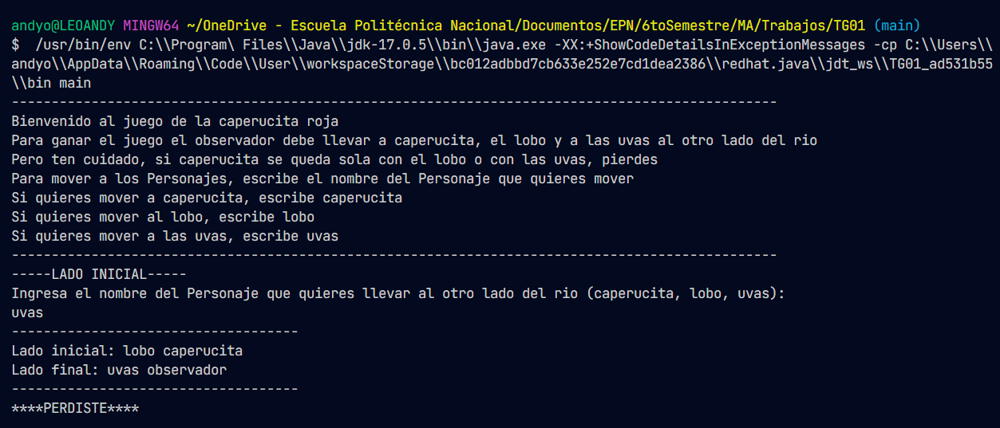
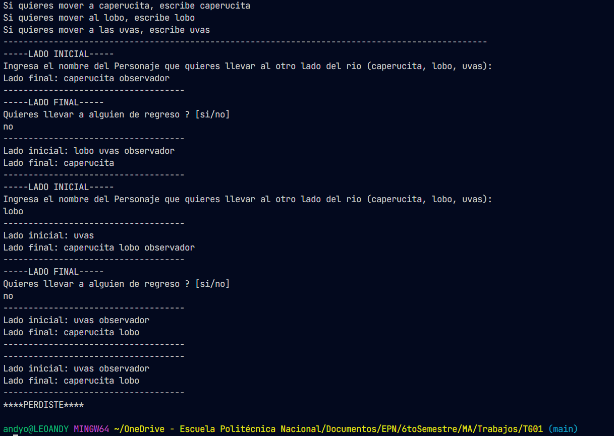
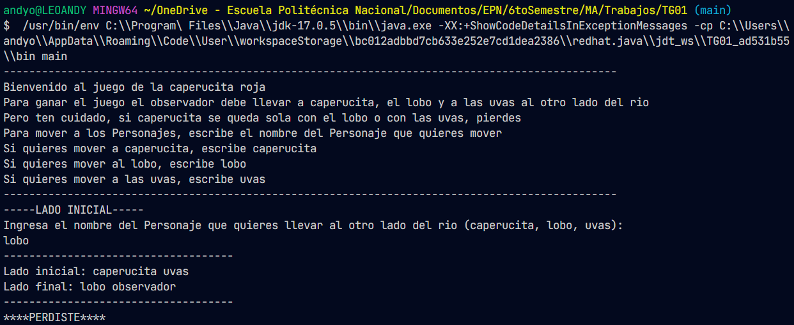
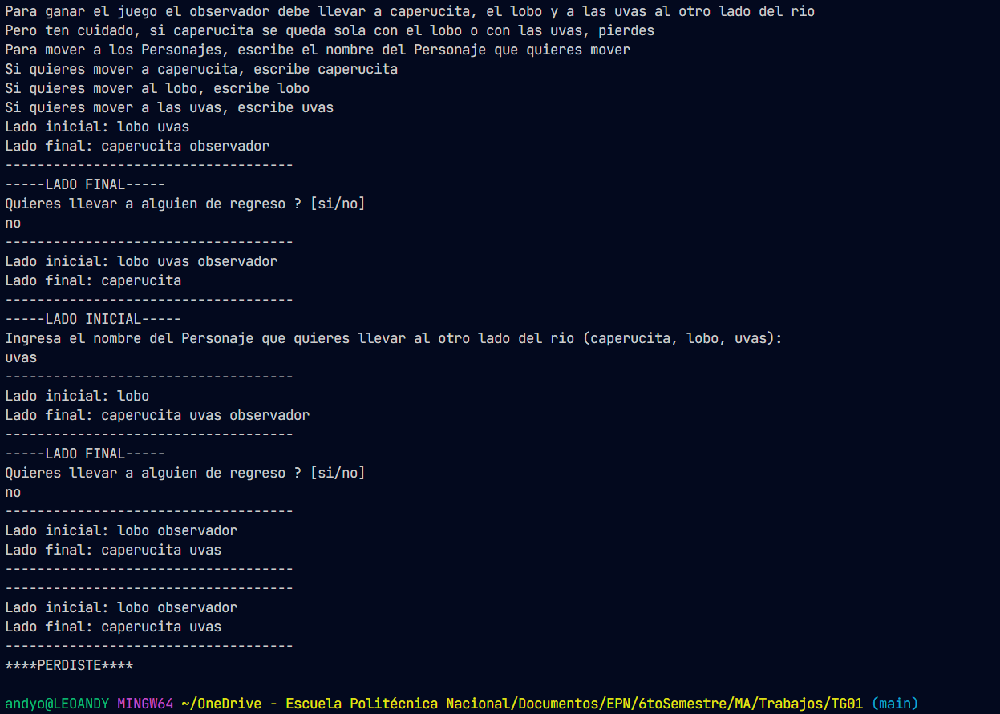
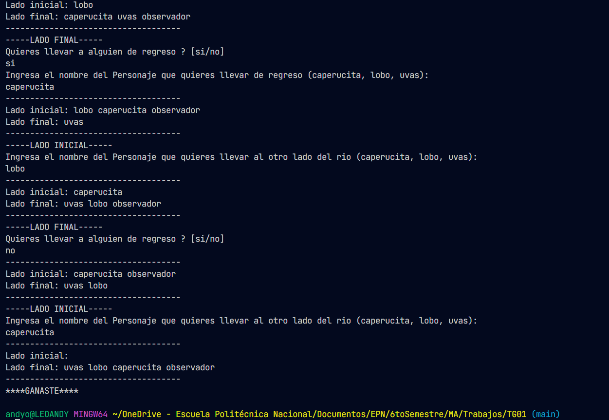

# Pruebas

## Prueba N°1

| Nombre:               | Muere Caperucita                                                                                                                 |
| --------------------- | -------------------------------------------------------------------------------------------------------------------------------- |
| Condición             | La caperucita se queda sola con el lobo y muere                                                                                  |
| Pasos:                | El observador se lleva las uvas y deja sola a la caperucita con el lobo, El observador se lleva a la caperuita y despues al lobo |
| Resultados Esperados: | Muere la caperucita                                                                                                              |

## Prueba N°2

| Nombre:               | Caperucita se come las uvas                                                                                                   |
| --------------------- | ----------------------------------------------------------------------------------------------------------------------------- |
| Condición             | La caperucita se queda sola con las uvas y se las come                                                                        |
| Pasos:                | El observador se lleva al lobo y la caperucita se come las uvas, El observador se lleva a las caperucita y despues a las uvas |
| Resultados Esperados: | La caperucita se come las uvas                                                                                                |

## Prueba N°3

| Nombre:               | Todos pasan el rio sanos y salvos                                                                                                                                                                                                             |
| --------------------- | --------------------------------------------------------------------------------------------------------------------------------------------------------------------------------------------------------------------------------------------- |
| Condición             | La caperucita, el lobo, las uvas y el observador pasan el rio sanos y salvos                                                                                                                                                                  |
| Pasos:                | El observador se lleva a la caperucita, despues regresa sin nadie y se lleva a las uvas, se regresa con la caperucita y la deja del otro lado y se lleva al lobo para finalmente pasar a la caperucita al otro lado del río con todos a salvo |
| Resultados Esperados: | Todos cruzan el río a salvo                                                                                                                                                                                                                   |

# Resultados pruebas

## Prueba 1.1

### Evidencia

- La prueba se culminó con éxito

## Prueba 1.2

### Evidencia

- La prueba se culminó con éxito

## Prueba 2.1

### Evidencia

- La prueba se culminó con éxito

## Prueba 2.2

### Evidencia

- La prueba se culminó con éxito

## Prueba 3

### Evidencia

- La prueba se culminó con éxito

# Reunión con Cliente

## Firma

| Xavier Paredes |
| -------------- |
| Cliente        |
